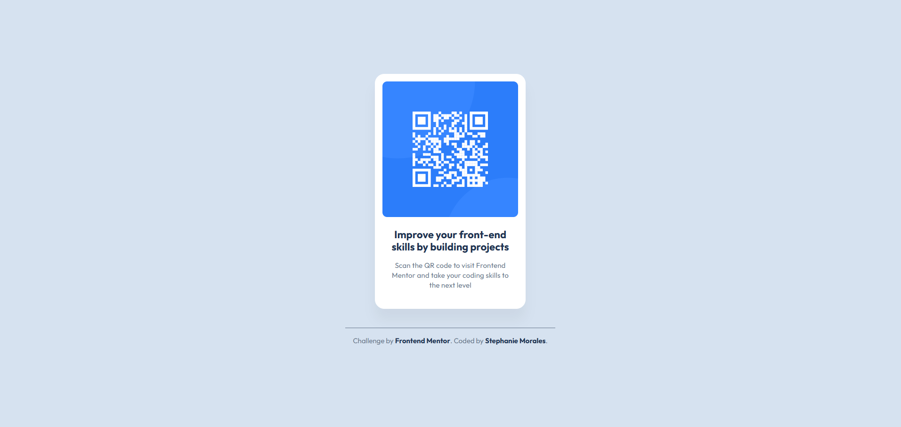

# Frontend Mentor - QR code component solution

This is a solution to the [QR code component challenge on Frontend Mentor](https://www.frontendmentor.io/challenges/qr-code-component-iux_sIO_H).  
Frontend Mentor challenges help you improve your coding skills by building realistic projects.

## Table of contents

- [Overview](#overview)
  - [Screenshot](#screenshot)
  - [Links](#links)
- [My process](#my-process)
  - [Built with](#built-with)
  - [What I learned](#what-i-learned)
  - [Continued development](#continued-development)
  - [Useful resources](#useful-resources)
- [Author](#author)
- [Acknowledgments](#acknowledgments)

## Overview

### Screenshot



### Links

- Solution URL: _(coming soon)_
- Live Site URL: _(coming soon)_

## My process

### Built with

- Semantic HTML5 markup  
- CSS custom properties (variables)  
- Flexbox  
- Mobile-first workflow  
- BEM naming

### What I learned

- I learned how to use **CSS variables** to make styles easier and more consistent.
- I practiced **BEM** to write cleaner and more organized CSS.

**CSS variables example**

```css
:root {
    /* Colors */
    --white: hsl(0, 0%, 100%);
    --slate-300: hsl(212, 45%, 89%);
    --slate-500: hsl(216, 15%, 48%);
    --slate-900: hsl(218, 44%, 22%);

    /* Typography */
    --font-sans: 'Outfit', sans-serif;

    --preset-1: 700 22px/1.2 var(--font-sans);
    --preset-2: 400 15px/1.4 var(--font-sans);

    /* Spacing */
    --spacing-200: 16px;
    --spacing-300: 24px;
    --spacing-500: 40px;

    /* Borders */
    --border-small: 10px;
    --border-large: 20px;
}
```

**BEM Example**

```html
<main class="card">
  
  <div class="card__content">
    <h1 class="card__title">Improve your front-end skills by building projects</h1>
    <p class="card__text">Scan the QR code to visit Frontend Mentor and take your coding skills to the next level</p>
  </div>
</main>
```

### Continued Development

- Keep practicing BEM in larger components.
- Explore CSS Grid for more complex layouts.

### Useful resources  

- [MDN – CSS Custom Properties](https://developer.mozilla.org/en-US/docs/Web/CSS/Using_CSS_custom_properties)  
- [BEM](https://en.bem.info/methodology/)  

## Author  

- Frontend Mentor – [@smmu94](https://www.frontendmentor.io/profile/smmu94)  
- GitHub – [@smmu94](https://github.com/smmu94)  
